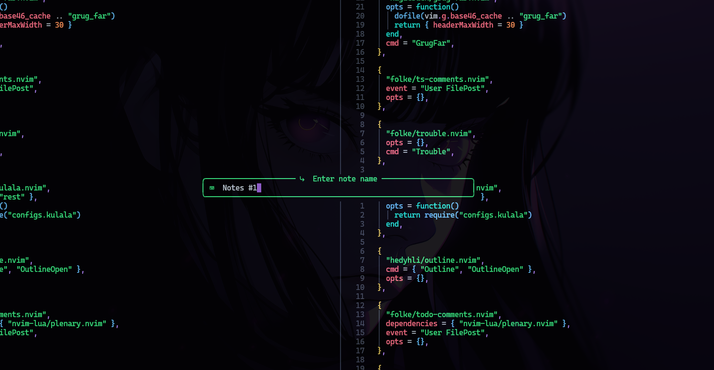
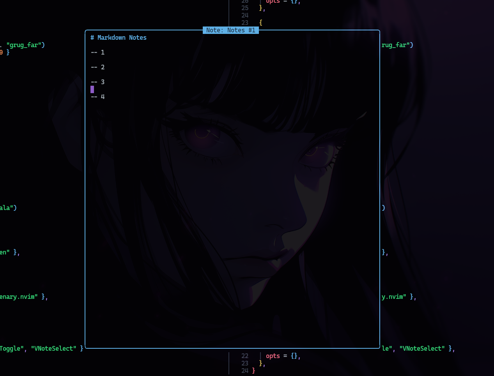
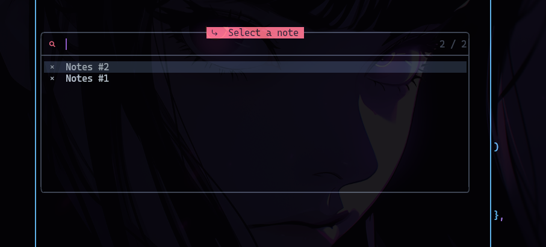

# vnotes.nvim

A simple Neovim note-taking plugin with floating window UI.

## Features

- Create and open markdown notes in a floating window.
- Select notes easily with a fuzzy finder.
- Auto-save on buffer close.

## Installation

Using your favorite plugin manager:

Using [lazy.nvim](https://github.com/folke/lazy.nvim)
```lua
  {
    "0xrinful/vnotes.nvim",
    cmd = { "VNoteCreate", "VNoteToggle", "VNoteSelect" },
    opts = {}
  },

```

## Usage

After installing and configuring the plugin, you can use these commands in Neovim:

- `:VNoteCreate`
     Opens a prompt to create a new note. Enter the note name, and a floating window will open for you to edit the note.
  
  


- `:VNoteToggle`:
     Toggle the currently selected note in a floating window. If no note is selected, it will prompt you to select one.

  

- `:VNoteSelect`  
     Opens a prompt to select an existing note from your notes directory to open it in a floating window.

  
  
> **Important Note:**  
> To get the best UI experience, this plugin requires a UI-enhancing plugin that improves `vim.ui.input` and `vim.ui.select`, such as [Telescope-ui-select](https://github.com/nvim-telescope/telescope-ui-select.nvim) or [Noice](https://github.com/folke/noice.nvim).

## Configuration

You can configure `vnotes` by calling the `setup` function with your preferred options:

```lua
require("vnotes").setup({
  notes_dir = vim.fn.stdpath("data") .. "/notes",  -- Directory to store notes
  width_ratio = 0.8,                               -- Floating window width relative to editor width
  min_width = 75,                                  -- Floating window width relative to nvim columns number
  height_ratio = 0.8,                              -- Floating window height relative to editor height
  border = "rounded",                              -- Border style for floating window
  title_hl = "Title",                              -- Highlight group for window title
  title_pos = "center",                            -- Position of window title
  style = "minimal",                               -- Window style
})
```
